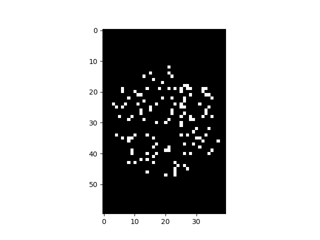
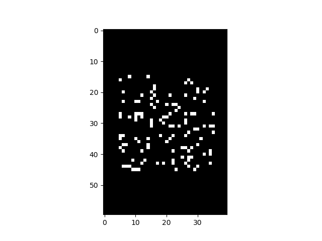
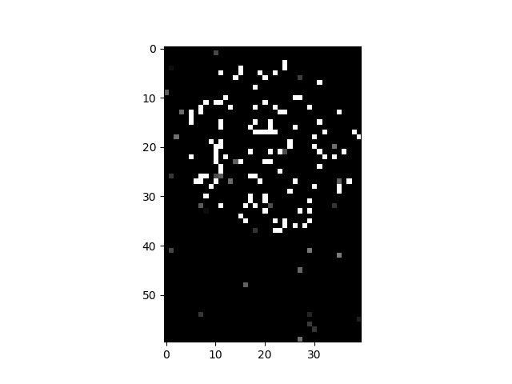

# binary-image-classifier


## Data

Data for training the binary classifier is stored in:
```bash
./data/train
```
There are two numpy files named ``` class_a.npy ``` and ``` class_b.npy ```.
These numpy arrays store image data to train the classifier. 

-----------------------------------

## Visualization

As data is in the numpy array we need a simple script to visualize it. To *see* images in each numpy array run the script
```bash
./src/Visualize.py
```
Sample images from each array are shown below:

 
Class A                                     |  Class B                                    |  Test Image
:------------------------------------------:|:-------------------------------------------:|:---------------------------------------:
             |              | 


-------------------------------------------------------------------
## Dependencies

This code is implemented in [Keras](http://keras.io/) using [Tensorflow API r1.0](https://www.tensorflow.org/api_docs/) backend. 
You can follow the [online instructions](https://www.tensorflow.org/install/) to install Tensorflow 1.0.
Other dependencies like [numpy](http://www.numpy.org/), [scikit-image](http://scikit-image.org/) and
[matplotlib](https://matplotlib.org/) can be install by [pip](https://pypi.python.org/pypi/pip).


--------------------------------------------------------------------

## Training

Model can be trained right off the bat using ``` ./src/Train.py ``` . Labels are manually encoded using a small script. After training the model is saved in the ``` ./model ``` directory and the variable is deleted.
Special evaluation metrics are used while training the model for better optimization. They are explained as follows:

* [**Matthews Correlation:**](https://en.wikipedia.org/wiki/Matthews_correlation_coefficient) Matthews_correlation is often regarded as the best measure for binary classification
as latest versions of keras removed this useful metrics, I have written a version following source code of previous versions of keras
A value close to 1 is often regarded as best.

* [**F1 Score:**](https://en.wikipedia.org/wiki/F1_score) F1 score is often a good measure to gauge a model performance
The function below calculates precision and recall and then calculates
F1 score using the formula mentioned in the return method

Model is compiled on [Catergorical Crossentropy](https://peltarion.com/knowledge-center/documentation/modeling-view/build-an-ai-model/loss-functions/categorical-crossentropy)
and [Adam](https://en.wikipedia.org/wiki/Stochastic_gradient_descent#Adam) optimizer.

-------------------------------------------------------------------

## Prediction

Saved model can be used for prediction purpose. To predict labels for all images in ``` field.npy ``` run the script: 
```bash
./src/To_predict.py
```
 *Predicted* labels are saved in ``` Labels_predicted_by_trained_model.csv ```

